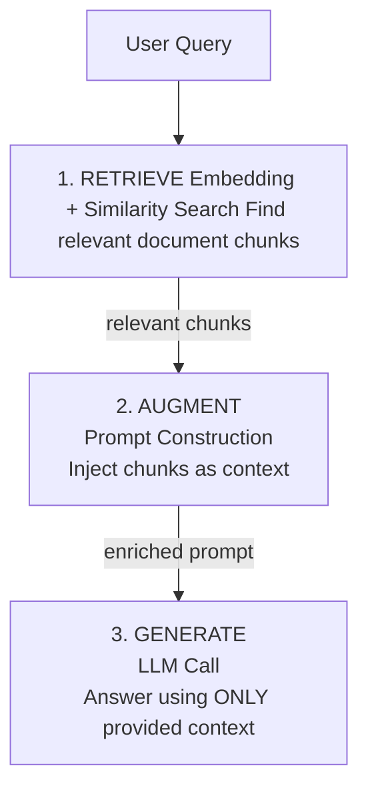
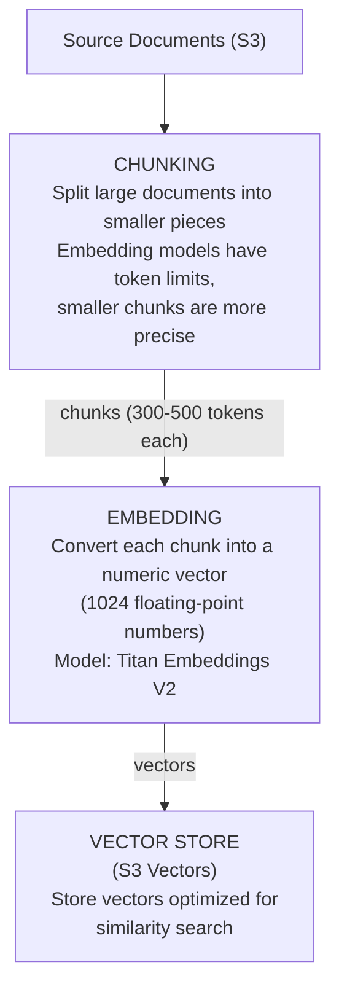
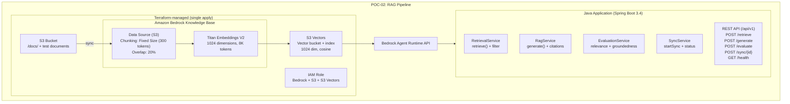
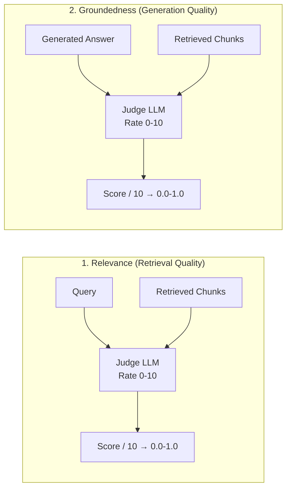

# POC-02: RAG Pipeline with Amazon Bedrock Knowledge Bases

## What You Will Learn

This POC teaches you how to build a complete **Retrieval-Augmented Generation (RAG)** pipeline using Amazon Bedrock Knowledge Bases. By the end, you will understand:

1. **What RAG is** and why it solves the hallucination problem
2. **How documents become searchable** through chunking and embedding
3. **Two retrieval patterns** — direct chunk retrieval vs. end-to-end generation
4. **How to evaluate RAG quality** using the LLM-as-judge pattern
5. **Pure IaC deployment** — entire pipeline managed by Terraform, zero scripts

> **AIP-C01 Exam Relevance:** RAG accounts for roughly 15-20% of the exam. You need to understand when to choose Knowledge Bases over custom vector stores, the trade-offs between chunking strategies, and how to measure retrieval quality.

---

## Core Concepts Explained

### What is RAG?

Large Language Models (LLMs) are trained on a fixed dataset. When you ask about your company's internal documents, the model has no knowledge of them and may "hallucinate" — confidently generate incorrect answers.

**RAG solves this** by adding a retrieval step before generation:



The key insight: **the model does not need to "know" the answer — it just needs to read and summarize the relevant documents you provide.**

### How Documents Become Searchable

Before you can retrieve anything, documents must go through an ingestion pipeline:



This is exactly what Amazon Bedrock Knowledge Bases manages for you automatically.

### Two Retrieval Patterns

This POC implements both patterns so you can compare them:

| Pattern | API | What You Get | When to Use |
|---------|-----|--------------|-------------|
| **Retrieve** | `RetrieveRequest` | Raw document chunks with scores | When you want control over the generation step (custom prompts, post-processing) |
| **RetrieveAndGenerate** | `RetrieveAndGenerateRequest` | A generated answer with citations | When you want an end-to-end answer with source attribution out of the box |

> **Exam Tip:** The exam tests whether you know the difference. `Retrieve` gives you chunks; `RetrieveAndGenerate` gives you a complete answer. Use `Retrieve` when you need to customize the prompt template or chain multiple steps.

---

## Architecture



---

## Tech Stack

| Layer | Technology | Version | Why This Choice |
|-------|------------|---------|-----------------|
| Infrastructure | Terraform | >= 1.5 | Reproducible, auditable AWS resource management |
| Storage | Amazon S3 | - | Scalable document storage with versioning |
| Knowledge Base | Bedrock KB | - | Fully managed RAG — no vector DB ops needed |
| Embeddings | Titan Embeddings V2 | v2:0 | AWS-native, 1024 dimensions, 8K token context |
| Vector Store | Amazon S3 Vectors | - | Cost-effective pay-per-use vector storage (Terraform-managed) |
| LLM | Claude 3 Haiku | v1 | Fast, cheap, sufficient for POC evaluation |
| Application | Java 21 | 21 | Modern Java with virtual threads support |
| Framework | Spring Boot | 3.4 | Production-ready REST API framework |
| AWS SDK | AWS SDK v2 | 2.29+ | Async clients via `CompletableFuture` |

---

## Project Structure

```
POC-02-rag-pipeline/
├── terraform/                          # Infrastructure as Code (all resources)
│   ├── main.tf                         # AWS provider configuration (v6.27+)
│   ├── variables.tf                    # Input variables (region, chunking config)
│   ├── s3.tf                           # Document storage bucket
│   ├── s3-vectors.tf                   # S3 Vector bucket + index (1024 dim, cosine)
│   ├── documents.tf                    # Test document upload to S3
│   ├── iam.tf                          # KB execution role + S3 Vectors permissions
│   ├── knowledge-base.tf              # Bedrock KB + S3 data source
│   ├── outputs.tf                      # Exported values (KB ID, bucket name, ARNs)
│   └── terraform.tfvars.example        # Example variable values
│
├── src/main/java/com/awslab/rag/
│   ├── RagApplication.java             # Spring Boot entry point
│   ├── config/
│   │   ├── BedrockConfig.java          # Three async AWS client beans
│   │   └── RagProperties.java          # KB configuration properties
│   ├── controller/
│   │   └── RagController.java          # REST API endpoints
│   ├── service/
│   │   ├── RetrievalService.java       # Direct chunk retrieval from KB
│   │   ├── RagService.java             # End-to-end RAG with citations
│   │   ├── EvaluationService.java      # LLM-as-judge quality metrics
│   │   └── SyncService.java            # KB document ingestion management
│   ├── model/                          # Request/Response DTOs
│   │   ├── RetrievalRequest.java       #   with Jakarta validation
│   │   ├── RetrievalResponse.java
│   │   ├── GenerateRequest.java
│   │   ├── GenerateResponse.java
│   │   ├── EvaluationRequest.java
│   │   ├── EvaluationResponse.java
│   │   └── Citation.java
│   └── exception/
│       ├── RagException.java           # Domain exception with error codes
│       └── GlobalExceptionHandler.java # Centralized HTTP error mapping
│
├── src/test/java/com/awslab/rag/      # Unit tests (62 tests, pure mocks)
│   ├── service/
│   │   ├── RetrievalServiceTest.java   # 11 tests
│   │   ├── RagServiceTest.java         # 10 tests
│   │   ├── EvaluationServiceTest.java  # 10 tests
│   │   └── SyncServiceTest.java        # 10 tests
│   ├── exception/
│   │   └── GlobalExceptionHandlerTest.java  # 9 tests
│   └── controller/
│       └── RagControllerTest.java      # 12 tests (@WebMvcTest)
├── src/test/resources/
│   └── application-test.yml            # Test configuration (no AWS needed)
│
├── test-docs/                          # Sample documents for Knowledge Base
│   ├── aws-well-architected.md         # + .metadata.json for each
│   ├── bedrock-pricing.md
│   └── lambda-best-practices.md
│
├── scripts/
│   └── test-queries.sh                 # Sample API calls for manual smoke testing
│
├── pom.xml                             # Maven build configuration
└── README.md
```

---

## Deep Dive: Chunking Strategies

Chunking is one of the most impactful decisions in a RAG pipeline. It determines how your documents are split before embedding. A poor chunking strategy leads to irrelevant retrievals, regardless of how good your LLM is.

### Why Chunk at All?

1. **Embedding models have token limits** — Titan V2 accepts up to 8K tokens, but shorter texts produce more focused embeddings
2. **Precision** — a 300-token chunk about "Lambda cold starts" is more retrievable than an entire 50-page PDF
3. **Cost** — each retrieved chunk becomes part of the LLM prompt; fewer, more relevant chunks = lower token costs

### Strategy Comparison

| Strategy | How It Works | Best For | Trade-off |
|----------|-------------|----------|-----------|
| **Fixed Size** | Split every N tokens with M% overlap | Code, uniform docs | Simple but may cut mid-sentence |
| **Hierarchical** | Parent chunks (1500 tokens) contain child chunks (300 tokens); retrieval uses children, context uses parents | Structured docs (PDF, HTML with sections) | Better context preservation, more storage |
| **Semantic** | Split at natural topic boundaries detected by the embedding model | Narratives, articles | Best coherence, but slower and variable chunk sizes |
| **None** | Keep entire document as one chunk | Small docs (< 300 tokens) | Full context, but only for tiny files |

### This POC Uses: Fixed Size

```hcl
# In terraform/knowledge-base.tf
chunking_configuration {
  chunking_strategy = "FIXED_SIZE"
  fixed_size_chunking_configuration {
    max_tokens         = 300    # Each chunk is at most 300 tokens
    overlap_percentage = 20     # 20% overlap between consecutive chunks
  }
}
```

**Why overlap?** Without it, a sentence split across two chunks loses its meaning in both. A 20% overlap ensures boundary sentences appear in at least one complete chunk.

> **Exam Tip:** When asked about chunking for technical documentation with code samples, choose **Fixed Size** with higher overlap (20%). For legal documents with clear sections, choose **Hierarchical**. For narrative content like articles, choose **Semantic**.

---

## Deep Dive: Search Types and S3 Vectors

When retrieving chunks, you choose how the vector database matches your query:

| Search Type | How It Works | Strengths | Weaknesses |
|-------------|-------------|-----------|------------|
| **SEMANTIC** | Converts query to a vector and finds nearest neighbors by cosine distance | Understands meaning ("car" matches "vehicle") | May miss exact keyword matches |
| **HYBRID** | Combines semantic similarity with keyword (BM25) search | Best of both worlds — meaning + exact terms | Slightly higher latency, **not supported by S3 Vectors** |

### Why This POC Uses SEMANTIC

S3 Vectors is a lightweight, cost-effective vector store that supports **SEMANTIC search only**. HYBRID search requires a full-featured vector database (e.g., OpenSearch Serverless) that maintains both a vector index and an inverted keyword index.

This is a deliberate trade-off:

| | S3 Vectors | OpenSearch Serverless |
|---|---|---|
| **Search types** | SEMANTIC only | SEMANTIC + HYBRID |
| **Minimum cost** | $0/month (pay-per-use) | ~$700/month (4 OCUs minimum) |
| **Terraform support** | `aws_s3vectors_vector_bucket` + `aws_s3vectors_index` | `aws_opensearchserverless_collection` |
| **Best for** | POCs, low-traffic workloads | Production with keyword-heavy queries |

> **Exam Tip:** If the question mentions "cost-effective vector store" or "pay-per-use", the answer is S3 Vectors. If it mentions "hybrid search" or "BM25", the answer is OpenSearch Serverless. Know the trade-off.

### S3 Vectors Metadata Configuration

S3 Vectors enforces a **2048-byte limit on filterable metadata**. Bedrock Knowledge Bases stores two internal keys per chunk:

- `AMAZON_BEDROCK_TEXT` — the actual chunk text (can be thousands of bytes)
- `AMAZON_BEDROCK_METADATA` — source URI, metadata attributes

Both must be declared as **non-filterable** to avoid ingestion failures:

```hcl
# In terraform/s3-vectors.tf
resource "aws_s3vectors_index" "main" {
  # ...
  metadata_configuration {
    non_filterable_metadata_keys = ["AMAZON_BEDROCK_TEXT", "AMAZON_BEDROCK_METADATA"]
  }
}
```

> **Gotcha:** If you forget this, ingestion succeeds at scanning but all documents fail with "Filterable metadata must have at most 2048 bytes". This is the single most common S3 Vectors + Bedrock KB integration error.

---

## Deep Dive: Evaluation with LLM-as-Judge

How do you know if your RAG pipeline is working well? You cannot manually review every response. Instead, this POC uses a pattern called **LLM-as-judge**: ask an LLM to rate the quality of another LLM's output.

### Two Metrics Implemented



**Why this matters:** A relevance score of 0.3 tells you your retrieval needs tuning (wrong chunking, too few results). A groundedness score of 0.4 tells you the LLM is fabricating instead of using the provided context.

> **Exam Tip:** The exam distinguishes between these metrics. Relevance measures retrieval quality. Groundedness (also called "faithfulness") measures generation quality. You need both to evaluate a full RAG pipeline.

---

## How to Run

### Prerequisites

- Java 21
- Maven 3.9+
- AWS CLI v2 configured with appropriate credentials
- Terraform >= 1.5

### Step 1: Deploy Infrastructure (single command)

Everything is managed by Terraform — S3 bucket, S3 Vectors (bucket + index), IAM roles, Knowledge Base, data source, and test document upload:

```bash
cd POC-02-rag-pipeline/terraform/
cp terraform.tfvars.example terraform.tfvars   # Edit if needed
terraform init
terraform apply
```

Note the outputs — you'll need `knowledge_base_id` and `data_source_id`.

### Step 2: Trigger Knowledge Base Ingestion

After Terraform uploads documents to S3, trigger the ingestion job to chunk, embed, and index them:

```bash
aws bedrock-agent start-ingestion-job \
    --knowledge-base-id <KB_ID> \
    --data-source-id <DS_ID> \
    --region us-east-1
```

Monitor progress (typically completes in under 30 seconds for test docs):

```bash
aws bedrock-agent get-ingestion-job \
    --knowledge-base-id <KB_ID> \
    --data-source-id <DS_ID> \
    --ingestion-job-id <JOB_ID> \
    --query 'ingestionJob.{status:status,stats:statistics}' \
    --region us-east-1
```

### Step 3: Run the Application

```bash
cd POC-02-rag-pipeline/
KNOWLEDGE_BASE_ID=<your-kb-id> mvn spring-boot:run
```

The API will be available at `http://localhost:8080`.

### Step 4: Run Tests (No AWS Credentials Needed)

```bash
mvn test
```

All 62 unit tests use mocked AWS SDK clients and run without any AWS infrastructure.

### Teardown

```bash
cd terraform/
terraform destroy
```

That's it. Terraform handles everything — including S3 Vectors bucket deletion (`force_destroy = true`).

---

## API Reference

### POST /api/v1/retrieve — Direct Chunk Retrieval

Retrieves raw document chunks from the Knowledge Base without generating an answer. Use this when you want full control over what happens with the retrieved context.

```bash
curl -X POST http://localhost:8080/api/v1/retrieve \
  -H "Content-Type: application/json" \
  -d '{
    "query": "What are the pillars of AWS Well-Architected Framework?",
    "numberOfResults": 5,
    "searchType": "SEMANTIC",
    "filter": {"category": "architecture"}
  }'
```

**Response:** List of chunks with content, source URI, relevance score, and metadata.

### POST /api/v1/generate — End-to-End RAG

Retrieves relevant chunks AND generates a complete answer with source citations.

```bash
curl -X POST http://localhost:8080/api/v1/generate \
  -H "Content-Type: application/json" \
  -d '{
    "query": "How should I optimize Lambda cold starts?",
    "numberOfResults": 5,
    "temperature": 0.0,
    "maxTokens": 1024
  }'
```

**Response:** Generated answer text, list of citations (with source URIs and generated span positions), and latency.

### POST /api/v1/evaluate — RAG Quality Evaluation

Evaluates the quality of retrieval and generation using the LLM-as-judge pattern.

```bash
curl -X POST http://localhost:8080/api/v1/evaluate \
  -H "Content-Type: application/json" \
  -d '{
    "query": "What are Lambda best practices?",
    "answer": "Use provisioned concurrency to reduce cold starts...",
    "retrievedChunks": ["Lambda cold starts occur when...", "Best practices include..."]
  }'
```

**Response:** Relevance score (0.0-1.0), groundedness score (0.0-1.0), and latency.

### POST /api/v1/sync/{dataSourceId} — Start Document Sync

Triggers an ingestion job to sync new or updated documents from S3 into the Knowledge Base.

```bash
curl -X POST http://localhost:8080/api/v1/sync/<data-source-id>
```

**Response:** Job ID, status, and start timestamp.

### GET /api/v1/sync/{dataSourceId}/status/{jobId} — Check Sync Status

```bash
curl http://localhost:8080/api/v1/sync/<data-source-id>/status/<job-id>
```

**Response:** Job status (STARTING, IN_PROGRESS, COMPLETE, FAILED), timestamps, document statistics, and failure reasons if applicable.

### GET /api/v1/health — Health Check

```bash
curl http://localhost:8080/api/v1/health
```

**Response:** `{"status": "UP", "service": "rag-pipeline"}`

---

## Metadata Filtering

Not all documents are relevant to every query. Metadata filtering lets you narrow retrieval to specific document categories before similarity search runs.

### How It Works

Each document in S3 can have a companion `.metadata.json` file:

```json
{
  "metadataAttributes": {
    "category": "security",
    "year": 2024,
    "author": "aws"
  }
}
```

When you pass a `filter` in the retrieve request, only chunks from matching documents are considered:

```json
{
  "query": "What are the security best practices?",
  "filter": {"category": "security"}
}
```

### Single vs. Multiple Filters

- **One filter field** → uses an `equals` condition
- **Multiple filter fields** → combines them with `AND` (all conditions must match)

This is implemented in `RetrievalService.buildFilter()` using the AWS SDK's `RetrievalFilter` with `equalsValue()` and `andAll()`.

---

## Cost Analysis

| Resource | Pricing | POC Estimate |
|----------|---------|--------------|
| Bedrock KB | No charge for the KB itself | $0 |
| S3 Vectors | Pay per vector stored + query | ~$0.01/month |
| Titan Embeddings V2 | $0.00002/1K tokens | ~$0.10/month |
| Claude 3 Haiku | $0.00025/1K input, $0.00125/1K output | ~$0.20/month |
| S3 Storage | $0.023/GB | ~$0.01/month |
| **Total POC Cost** | | **< $0.50/month** |

> **Key Learning:** Using S3 Vectors instead of OpenSearch Serverless saves ~$350/month in baseline costs. OpenSearch Serverless requires a minimum of 4 OCUs ($0.24/h each), which adds up to ~$700/month even with zero queries. S3 Vectors has no minimum — you pay only for what you use.

---

## Troubleshooting

| Symptom | Likely Cause | Solution |
|---------|-------------|----------|
| Ingestion: "Filterable metadata must have at most 2048 bytes" | Missing non-filterable keys in S3 Vectors index | Add `AMAZON_BEDROCK_TEXT` and `AMAZON_BEDROCK_METADATA` to `non_filterable_metadata_keys` |
| "HYBRID search type is not supported" | S3 Vectors only supports SEMANTIC | Change search type to `SEMANTIC` in request or `application.yml` |
| KB sync fails | Missing IAM permissions | Verify role has `s3:GetObject`, `s3:ListBucket`, and `s3vectors:*` |
| Empty retrieval results | Sync not complete | Check sync status — ingestion is async |
| Low relevance scores | Suboptimal chunking | Try Hierarchical for structured docs, increase overlap |
| High retrieval latency | Knowledge Base cold start | KB scales down after inactivity; first request is slower |
| "Model not available" error | Region mismatch | Model ARN region must match KB region |
| Throttling errors (429) | Too many concurrent requests | Implement exponential backoff (handled by `RagException.THROTTLING`) |
| `terraform init` slow (800MB+) | AWS provider is a monolithic binary | Normal — cached after first run. Delete `.terraform/` to reclaim space between sessions |

---

## Exam Topics Covered (AIP-C01)

| Domain | Topic | Where in This POC |
|--------|-------|--------------------|
| **Domain 1** | Knowledge Base architecture | `terraform/knowledge-base.tf`, `BedrockConfig.java` |
| **Domain 1** | Chunking strategies | Terraform chunking config, Deep Dive section above |
| **Domain 1** | Embedding model selection | Titan V2 in `knowledge-base.tf` and `application.yml` |
| **Domain 1** | Vector store selection | S3 Vectors vs. OpenSearch trade-off in Deep Dive section |
| **Domain 2** | Retrieve API | `RetrievalService.java` — direct chunk retrieval |
| **Domain 2** | RetrieveAndGenerate API | `RagService.java` — end-to-end RAG with citations |
| **Domain 2** | Metadata filtering | `RetrievalService.buildFilter()` with `equalsValue()` / `andAll()` |
| **Domain 2** | Source attribution | `RagService.extractCitations()` — span mapping |
| **Domain 3** | RAG evaluation metrics | `EvaluationService.java` — LLM-as-judge pattern |
| **Domain 4** | Cost optimization | S3 Vectors vs. OpenSearch Serverless comparison |

---

## Success Criteria

- [x] Terraform deploys all resources without errors (18 resources in ~20s)
- [x] S3 Vector bucket and index created via Terraform (`aws_s3vectors_*`)
- [x] Test documents uploaded to S3 via Terraform (`aws_s3_object`)
- [x] Knowledge Base syncs documents successfully (3 docs, ~7s)
- [x] Retrieve API returns relevant chunks (relevance > 0.7)
- [x] RetrieveAndGenerate produces answers grounded in source documents
- [x] Citations correctly reference source S3 URIs
- [x] Evaluation service computes relevance and groundedness scores
- [x] All 62 unit tests pass (`mvn test`)
- [ ] You can explain chunking trade-offs for the exam

---

## References

- [Amazon Bedrock Knowledge Bases — User Guide](https://docs.aws.amazon.com/bedrock/latest/userguide/knowledge-base.html)
- [Amazon S3 Vectors — User Guide](https://docs.aws.amazon.com/AmazonS3/latest/userguide/s3-vectors.html)
- [S3 Vectors with Bedrock KB](https://docs.aws.amazon.com/AmazonS3/latest/userguide/s3-vectors-bedrock-kb.html)
- [Chunking and Parsing Configuration](https://docs.aws.amazon.com/bedrock/latest/userguide/kb-chunking-parsing.html)
- [RetrieveAndGenerate API Reference](https://docs.aws.amazon.com/bedrock/latest/APIReference/API_agent-runtime_RetrieveAndGenerate.html)
- [Terraform: aws_s3vectors_vector_bucket](https://registry.terraform.io/providers/hashicorp/aws/latest/docs/resources/s3vectors_vector_bucket)
- [Terraform: aws_s3vectors_index](https://registry.terraform.io/providers/hashicorp/aws/latest/docs/resources/s3vectors_index)
- [Terraform: aws_bedrockagent_knowledge_base](https://registry.terraform.io/providers/hashicorp/aws/latest/docs/resources/bedrockagent_knowledge_base)
- [AWS SDK for Java v2 — Bedrock Agent Runtime](https://sdk.amazonaws.com/java/api/latest/software/amazon/awssdk/services/bedrockagentruntime/package-summary.html)
