# POC-03: Tool Use & Bedrock Agents

## What You Will Learn

This POC teaches you how to give LLMs the ability to **take actions** — query databases, call APIs, and make decisions autonomously. You will implement two distinct patterns for tool-augmented AI and learn when to choose each.

By the end, you will understand:

1. **What Tool Use is** and how it transforms an LLM from a text generator into an autonomous agent
2. **Programmatic Tool Use** — controlling the reasoning loop yourself via the Converse API
3. **Managed Agents** — delegating orchestration to Amazon Bedrock Agents with Action Groups
4. **The ReAct pattern** — how LLMs reason, act, observe, and iterate
5. **When to choose which pattern** — the architectural trade-offs for the exam

> **AIP-C01 Exam Relevance:** Tool use and Bedrock Agents account for roughly 15-20% of the exam. You must understand the Converse API `toolConfig`, the ReAct loop, Action Group schemas, Return of Control, and when to use managed agents vs. programmatic orchestration.

---

## Core Concepts Explained

### What is Tool Use?

LLMs generate text. They cannot query databases, call APIs, or read files on their own. **Tool Use** bridges this gap by giving the model a catalog of available functions and letting it decide which ones to call.

```
Without Tools:
  User: "How many flights from WAW to CDG on March 15?"
  LLM:  "I don't have access to flight databases." (or worse, hallucinated data)

With Tools:
  User: "How many flights from WAW to CDG on March 15?"
  LLM:  [THINKS] I need to search for flights → calls searchFlights(WAW, CDG, 2025-03-15)
  Tool: Returns 3 flights: [LO335, AF1145, LH1234]
  LLM:  "There are 3 flights from Warsaw to Paris on March 15: LO335, AF1145, and LH1234."
```

The key insight: **the model does not execute the tool — it decides WHICH tool to call and with WHAT parameters. Your application executes the tool and returns the result.**

### The ReAct Pattern (Reason + Act)

ReAct is the prompting strategy that makes tool use work. The model follows a loop:

```mermaid
flowchart TD
    T1["🧠 THOUGHT: I need to find flights\nfrom WAW to CDG on March 15"]
    A1["⚡ ACTION: searchFlights\n(WAW, CDG, 2025-03-15)"]
    O1["📋 OBSERVATION:\nLO335 €450, AF1145 €380"]
    T2["🧠 THOUGHT: User wants the cheapest.\nLet me get details on AF1145"]
    A2["⚡ ACTION: getFlightDetails\n(AF1145)"]
    O2["📋 OBSERVATION:\ndeparture 08:30, arrival 10:45,\nAir France"]
    ANS["✅ ANSWER: The cheapest is AF1145\nby Air France at €380,\ndeparting 08:30, arriving 10:45"]

    T1 --> A1 --> O1 --> T2 --> A2 --> O2 --> ANS
```



The model iterates through Thought → Action → Observation until it has enough information to produce a final answer. This is not a single LLM call — it is a **multi-turn loop** where each iteration may invoke a different tool.

> **Exam Tip:** The exam tests whether you understand that ReAct requires multiple LLM invocations. Each tool call is a separate round-trip: model generates a tool request → your code executes it → you send the result back → model continues reasoning.

### Two Patterns for Tool Use

This POC implements both patterns so you can compare them — the same approach used in POC-02 with Retrieve vs. RetrieveAndGenerate.

| Aspect | Pattern A: Programmatic (Converse API) | Pattern B: Managed (Bedrock Agents) |
|--------|----------------------------------------|--------------------------------------|
| **Who runs the loop?** | Your Java code | AWS Bedrock service |
| **API** | `Converse` / `ConverseStream` with `toolConfig` | `InvokeAgent` |
| **Tool definition** | Java objects in `toolConfig` | OpenAPI 3.0 schema in Action Group |
| **Tool execution** | Your code calls the function directly | AWS invokes a Lambda function |
| **Session state** | You manage conversation history | AWS manages via `sessionId` |
| **Customization** | Full control over prompts, retries, routing | Limited to agent instructions |
| **Latency** | Lower (direct API calls) | Higher (agent orchestration overhead) |
| **Best for** | Custom orchestration, complex routing, hybrid tools | Standard CRUD tools, rapid prototyping |

> **Exam Tip:** The exam asks "when should you use Bedrock Agents vs. Converse API with tools?" The answer: use **Agents** when you want AWS to manage the orchestration loop and you have standard REST-like tools. Use **Converse API** when you need custom control over the reasoning process, tool routing, or when tools are in-process (no Lambda needed).

### Return of Control

A critical concept: **who decides whether to execute a tool?**

| Mode | How It Works | Risk Level |
|------|-------------|------------|
| **Auto-execute** (Pattern B default) | Agent calls Lambda automatically when the model requests a tool | Higher — model decides unilaterally |
| **Return of Control** | Agent returns the tool request to your code; you decide whether to execute | Lower — human/code approval gate |
| **Programmatic** (Pattern A) | Your code always decides — you receive `stopReason=tool_use` and choose what to do | Full control |

In Pattern A (Converse API), Return of Control is inherent — you always receive the tool call request and decide whether to execute it. In Pattern B (Bedrock Agents), you can configure Return of Control in the Action Group to add an approval step.

> **Exam Tip:** "Return of Control" is an exam term. It means the agent pauses and returns the tool invocation details to the calling application instead of executing the tool directly. This is used for safety-critical operations (payments, deletions) where you want human or business-logic approval.

---

## Architecture


### Why Two Patterns Share the Same Data?

Both patterns query the same DynamoDB table. This lets you compare them fairly — identical inputs, identical data, different orchestration. The only difference is **who controls the reasoning loop**.

---

## Tech Stack

| Layer | Technology | Version | Why This Choice |
|-------|------------|---------|-----------------|
| Infrastructure | Terraform | >= 1.5 | Reproducible, auditable AWS resource management |
| Database | Amazon DynamoDB | - | Serverless, pay-per-request, natural fit for Lambda tools |
| LLM | Claude 3.5 Haiku | v1 | Cost-optimized for POC — strong tool-use support at ~4x lower cost than Sonnet |
| Agents | Bedrock Agents | - | Managed ReAct orchestration with Action Groups |
| Application | Java 21 | 21 | Modern Java with records and pattern matching |
| Framework | Spring Boot | 3.4 | Production-ready REST API, consistent with POC-01/02 |
| AWS SDK | AWS SDK v2 | 2.29+ | Async clients, `BedrockRuntimeAsyncClient` + `BedrockAgentRuntimeAsyncClient` |
| Tool Schema | OpenAPI 3.0 | 3.0.3 | Required format for Bedrock Agent Action Groups |

### Why Not LangChain4j?

POC-01 and POC-02 use raw AWS SDK v2. This POC continues that pattern for consistency and deeper learning. Using the raw SDK forces you to understand exactly how tool use works at the protocol level — how `toolConfig` is structured, what `stopReason=tool_use` means, and how to construct `toolResult` messages. LangChain4j abstracts all of this away, which is great for production but hides the exam-relevant details.

---

## Project Structure

```
POC-03-tool-use-and-agents/
├── terraform/                              # Infrastructure as Code
│   ├── main.tf                             # AWS provider + backend
│   ├── variables.tf                        # Input variables (region, project)
│   ├── outputs.tf                          # Exported values (agent ID, table name)
│   ├── dynamodb.tf                         # Flights table + GSI
│   ├── lambda.tf                           # Tool handler Lambda + IAM
│   ├── bedrock-agent.tf                    # Bedrock Agent + Action Group
│   └── iam.tf                              # Agent execution role + permissions
│
├── openapi/
│   └── flight-tools.yaml                   # OpenAPI 3.0 schema for Action Group
│
├── src/main/java/com/awslab/agent/
│   ├── AgentApplication.java               # Spring Boot entry point
│   ├── config/
│   │   ├── BedrockConfig.java              # Async client beans (Runtime + AgentRuntime)
│   │   └── AgentProperties.java            # Agent ID, model ID, table name
│   ├── controller/
│   │   └── AgentController.java            # REST API endpoints
│   ├── service/
│   │   ├── ToolUseService.java             # Pattern A: Converse API with toolConfig
│   │   ├── AgentService.java               # Pattern B: InvokeAgent with sessionId
│   │   ├── ComparisonService.java          # Run both patterns, compare results
│   │   └── FlightTool.java                 # Shared tool logic (DynamoDB queries)
│   ├── model/
│   │   ├── ToolUseRequest.java             # Request DTO for Pattern A
│   │   ├── AgentRequest.java               # Request DTO for Pattern B
│   │   ├── AgentResponse.java              # Unified response DTO
│   │   ├── ComparisonResponse.java         # Side-by-side comparison DTO
│   │   ├── Flight.java                     # Flight domain object
│   │   └── ToolDefinitions.java            # Tool schemas for Converse API
│   └── exception/
│       ├── AgentException.java             # Domain exception with error codes
│       └── GlobalExceptionHandler.java     # Centralized HTTP error mapping
│
├── src/main/resources/
│   └── application.yml                     # Spring configuration
│
├── src/test/java/com/awslab/agent/         # Unit tests (all mocked, no AWS needed)
│   ├── service/
│   │   ├── ToolUseServiceTest.java         # ReAct loop logic tests
│   │   ├── AgentServiceTest.java           # InvokeAgent tests
│   │   ├── FlightToolTest.java             # DynamoDB query logic tests
│   │   └── ComparisonServiceTest.java      # Comparison logic tests
│   ├── controller/
│   │   └── AgentControllerTest.java        # @WebMvcTest endpoint tests
│   └── exception/
│       └── GlobalExceptionHandlerTest.java # Error mapping tests
│
├── lambda/                                 # Lambda tool handler (for Pattern B)
│   ├── pom.xml                             # Minimal Lambda dependencies
│   └── src/main/java/com/awslab/agent/lambda/
│       └── FlightToolHandler.java          # Bedrock Agent Action Group handler
│
├── scripts/
│   ├── seed-dynamodb.py                    # Load sample flight data
│   └── test-agent.sh                       # Test both patterns via curl
│
├── pom.xml                                 # Maven build (Spring Boot app)
└── README.md
```

---

## Deep Dive: Programmatic Tool Use (Pattern A)

This is the pattern where **your code controls the entire ReAct loop**. You send messages to the Converse API with a `toolConfig` that describes available tools. When the model wants to use a tool, it returns `stopReason=tool_use` instead of `stopReason=end_turn`.

### How toolConfig Works

You describe your tools using the Converse API's `toolConfig` parameter:

```java
// Define a tool (equivalent to a function signature)
Tool searchFlightsTool = Tool.builder()
    .toolSpec(ToolSpecification.builder()
        .name("searchFlights")
        .description("Search for available flights between two airports on a given date")
        .inputSchema(ToolInputSchema.builder()
            .json(Document.mapBuilder()
                .putString("type", "object")
                .putDocument("properties", Document.mapBuilder()
                    .putDocument("origin", Document.mapBuilder()
                        .putString("type", "string")
                        .putString("description", "IATA airport code (e.g., WAW, CDG, JFK)")
                        .build())
                    .putDocument("destination", Document.mapBuilder()
                        .putString("type", "string")
                        .putString("description", "IATA airport code")
                        .build())
                    .putDocument("date", Document.mapBuilder()
                        .putString("type", "string")
                        .putString("description", "Travel date in YYYY-MM-DD format")
                        .build())
                    .build())
                .putList("required", List.of(
                    Document.fromString("origin"),
                    Document.fromString("destination"),
                    Document.fromString("date")))
                .build())
            .build())
        .build())
    .build();

// Pass tools in the Converse request
ConverseRequest request = ConverseRequest.builder()
    .modelId(modelId)
    .messages(messages)
    .toolConfig(ToolConfiguration.builder()
        .tools(searchFlightsTool, getFlightDetailsTool)
        .build())
    .build();
```

### The ReAct Loop in Code

```java
public AgentResponse executeWithTools(String userMessage) {
    List<Message> conversationHistory = new ArrayList<>();
    conversationHistory.add(userMessage(userMessage));

    while (true) {
        // Step 1: Call the model with tools
        ConverseResponse response = bedrockClient.converse(ConverseRequest.builder()
            .modelId(modelId)
            .messages(conversationHistory)
            .toolConfig(toolConfig)
            .build())
            .join();

        // Step 2: Check why the model stopped
        StopReason stopReason = response.stopReason();

        if (stopReason == StopReason.END_TURN) {
            // Model is done — extract final answer
            String answer = extractText(response);
            return new AgentResponse(answer, conversationHistory.size());
        }

        if (stopReason == StopReason.TOOL_USE) {
            // Model wants to call a tool — extract the request
            ToolUseBlock toolUse = extractToolUse(response);
            String toolName = toolUse.name();
            Document toolInput = toolUse.input();

            // Step 3: YOUR CODE decides whether to execute (Return of Control)
            String toolResult = executeTool(toolName, toolInput);

            // Step 4: Add assistant message (with tool request) to history
            conversationHistory.add(assistantMessage(response));

            // Step 5: Add tool result to history
            conversationHistory.add(toolResultMessage(toolUse.toolUseId(), toolResult));

            // Loop continues — model will reason about the result
        }
    }
}
```

### What `stopReason` Values Mean

| Value | Meaning | Your Action |
|-------|---------|-------------|
| `end_turn` | Model finished reasoning and produced a final answer | Extract text, return to user |
| `tool_use` | Model wants to call one or more tools | Execute tool(s), send results back |
| `max_tokens` | Response was cut off due to token limit | Increase `maxTokens` or summarize |
| `stop_sequence` | Model hit a stop sequence | Handle as end of response |

> **Exam Tip:** `stopReason=tool_use` is the key signal. When you see it, the `output.message.content` contains one or more `ToolUseBlock` objects with `name`, `input`, and `toolUseId`. You must return a `ToolResultBlock` with the matching `toolUseId`.

### Visualizing the ReAct Trace

Pattern A's biggest advantage is **full observability**. Your application logs every step of the reasoning process. Here is what a real trace looks like for the query *"Find the cheapest flight from WAW to CDG on March 15"*:

```
[ITERATION 1]
  → Calling Converse API with 1 user message + 2 tools
  ← stopReason: TOOL_USE
  ← THOUGHT: "I need to search for available flights from Warsaw (WAW) to
              Paris Charles de Gaulle (CDG) on March 15, 2025."
  ← ACTION:  toolName=searchFlights
              toolInput={"origin":"WAW","destination":"CDG","date":"2025-03-15"}
              toolUseId=tooluse_a1b2c3
  → Executing searchFlights locally (DynamoDB query)
  ← OBSERVATION: [
      {"flightId":"LO335","airline":"LOT","price":450,"departureTime":"06:45"},
      {"flightId":"AF1145","airline":"Air France","price":380,"departureTime":"08:30"},
      {"flightId":"LH1234","airline":"Lufthansa","price":520,"departureTime":"14:20"}
    ]
  → Sending toolResult for tooluse_a1b2c3

[ITERATION 2]
  → Calling Converse API with 4 messages (user + assistant + toolResult + context)
  ← stopReason: TOOL_USE
  ← THOUGHT: "The cheapest flight is AF1145 at €380. Let me get the full
              details for this flight."
  ← ACTION:  toolName=getFlightDetails
              toolInput={"flightId":"AF1145"}
              toolUseId=tooluse_d4e5f6
  → Executing getFlightDetails locally (DynamoDB query)
  ← OBSERVATION: {
      "flightId":"AF1145","airline":"Air France","origin":"WAW",
      "destination":"CDG","departureTime":"08:30","arrivalTime":"10:45",
      "aircraft":"Airbus A320","price":380,"availableSeats":23,
      "baggageIncluded":true
    }
  → Sending toolResult for tooluse_d4e5f6

[ITERATION 3]
  → Calling Converse API with 6 messages
  ← stopReason: END_TURN
  ← ANSWER: "The cheapest flight from Warsaw to Paris on March 15 is AF1145
             by Air France at €380. It departs at 08:30 and arrives at 10:45.
             The flight operates an Airbus A320 with 23 seats remaining.
             Baggage is included in the price."

Total: 3 iterations, 2 tool calls, 6 messages in history
```

This trace is invisible in Pattern B — the Bedrock Agent performs all iterations internally and only returns the final answer. For debugging, cost analysis, and audit compliance, Pattern A's transparency is a significant advantage.

> **Exam Tip:** The exam may ask how to debug an agent that produces wrong answers. With Pattern A, you can inspect each THOUGHT and OBSERVATION to find where the reasoning went wrong. With Pattern B, you rely on CloudWatch Logs and Bedrock's model invocation logging (which logs the agent's internal traces, but with less granularity).

---

## Deep Dive: Managed Agents (Pattern B)

This is the pattern where **AWS manages the entire ReAct loop**. You create a Bedrock Agent with an Action Group, and AWS handles the reasoning, tool invocation, and multi-turn orchestration.

### How Bedrock Agents Work

```
Your Application                    AWS Bedrock Agent Service
      │                                      │
      │  InvokeAgent(sessionId, message)     │
      │─────────────────────────────────────▶│
      │                                      │
      │                           ┌──────────┴──────────┐
      │                           │ 1. Read instructions  │
      │                           │ 2. THOUGHT: need to   │
      │                           │    search flights     │
      │                           │ 3. ACTION: call       │
      │                           │    searchFlights      │
      │                           │         │             │
      │                           │    ┌────▼────┐        │
      │                           │    │ Lambda  │        │
      │                           │    │ (tool)  │        │
      │                           │    └────┬────┘        │
      │                           │         │             │
      │                           │ 4. OBSERVATION:       │
      │                           │    [LO335, AF1145]    │
      │                           │ 5. THOUGHT: need      │
      │                           │    details for AF1145 │
      │                           │ 6. ACTION: call       │
      │                           │    getFlightDetails   │
      │                           │         │             │
      │                           │    ┌────▼────┐        │
      │                           │    │ Lambda  │        │
      │                           │    │ (tool)  │        │
      │                           │    └────┬────┘        │
      │                           │         │             │
      │                           │ 7. ANSWER: format     │
      │                           │    response           │
      │                           └──────────┬──────────┘
      │                                      │
      │  Response (streamed chunks)          │
      │◀─────────────────────────────────────│
      │                                      │
```

### Agent Configuration in Terraform

```hcl
resource "aws_bedrockagent_agent" "flight_assistant" {
  agent_name              = "flight-booking-assistant"
  agent_resource_role_arn = aws_iam_role.agent_role.arn
  foundation_model        = "anthropic.claude-3-5-sonnet-20241022-v2:0"
  instruction             = <<-EOT
    You are a flight booking assistant. You help users search for flights
    and get flight details. Always use the available tools to look up
    real data. Never make up flight information. When presenting results,
    include the flight ID, airline, departure time, arrival time, and price.
  EOT
  idle_session_ttl_in_seconds = 600
}

resource "aws_bedrockagent_agent_action_group" "flight_tools" {
  agent_id          = aws_bedrockagent_agent.flight_assistant.id
  action_group_name = "FlightTools"

  action_group_executor {
    lambda = aws_lambda_function.flight_tool_handler.arn
  }

  api_schema {
    payload = file("${path.module}/../openapi/flight-tools.yaml")
  }
}
```

### The OpenAPI Schema

Bedrock Agents require an OpenAPI 3.0 schema to describe the tools in an Action Group. This is the contract between the agent and the Lambda function:

```yaml
# openapi/flight-tools.yaml
openapi: "3.0.3"
info:
  title: "Flight Tools API"
  version: "1.0.0"
  description: "Tools for searching and retrieving flight information"

paths:
  /searchFlights:
    post:
      operationId: "searchFlights"
      summary: "Search available flights between two airports"
      description: >
        Searches the flight database for available flights on a given date.
        Returns a list of matching flights with basic information.
      requestBody:
        required: true
        content:
          application/json:
            schema:
              type: object
              required: [origin, destination, date]
              properties:
                origin:
                  type: string
                  description: "IATA airport code for departure (e.g., WAW, CDG, JFK)"
                destination:
                  type: string
                  description: "IATA airport code for arrival"
                date:
                  type: string
                  format: date
                  description: "Travel date in YYYY-MM-DD format"
      responses:
        "200":
          description: "List of matching flights"
          content:
            application/json:
              schema:
                type: array
                items:
                  type: object
                  properties:
                    flightId:
                      type: string
                    airline:
                      type: string
                    departureTime:
                      type: string
                    arrivalTime:
                      type: string
                    price:
                      type: number

  /getFlightDetails:
    post:
      operationId: "getFlightDetails"
      summary: "Get detailed information about a specific flight"
      description: >
        Retrieves full details for a specific flight by its ID, including
        aircraft type, available seats, baggage policy, and pricing tiers.
      requestBody:
        required: true
        content:
          application/json:
            schema:
              type: object
              required: [flightId]
              properties:
                flightId:
                  type: string
                  description: "Unique flight identifier (e.g., LO335)"
      responses:
        "200":
          description: "Flight details"
          content:
            application/json:
              schema:
                type: object
                properties:
                  flightId:
                    type: string
                  airline:
                    type: string
                  origin:
                    type: string
                  destination:
                    type: string
                  departureTime:
                    type: string
                  arrivalTime:
                    type: string
                  aircraft:
                    type: string
                  availableSeats:
                    type: integer
                  price:
                    type: number
                  baggageIncluded:
                    type: boolean
```

### Lambda Tool Handler

The Lambda function receives a structured event from the Bedrock Agent:

```java
public class FlightToolHandler implements RequestHandler<Map<String, Object>, Map<String, Object>> {

    private final DynamoDbClient dynamoDb = DynamoDbClient.create();

    @Override
    public Map<String, Object> handleRequest(Map<String, Object> event, Context context) {
        // Extract action group details from agent event
        String actionGroup = (String) event.get("actionGroup");
        String apiPath = (String) event.get("apiPath");
        List<Map<String, String>> parameters = (List<Map<String, String>>) event.get("requestBody")
            .get("content").get("application/json").get("properties");

        // Route to the correct tool
        String responseBody;
        if ("/searchFlights".equals(apiPath)) {
            responseBody = searchFlights(parameters);
        } else if ("/getFlightDetails".equals(apiPath)) {
            responseBody = getFlightDetails(parameters);
        } else {
            responseBody = "{\"error\": \"Unknown action: " + apiPath + "\"}";
        }

        // Return in the format Bedrock Agent expects
        return Map.of(
            "messageVersion", "1.0",
            "response", Map.of(
                "actionGroup", actionGroup,
                "apiPath", apiPath,
                "httpMethod", "POST",
                "httpStatusCode", 200,
                "responseBody", Map.of(
                    "application/json", Map.of(
                        "body", responseBody
                    )
                )
            )
        );
    }
}
```

### Session Management

Bedrock Agents maintain conversation state via `sessionId`. Each session remembers the full conversation history, so follow-up questions work naturally:

```java
// First message
InvokeAgentResponse response1 = agentClient.invokeAgent(InvokeAgentRequest.builder()
    .agentId(agentId)
    .agentAliasId(aliasId)
    .sessionId("session-123")
    .inputText("Find flights from WAW to CDG on March 15")
    .build());
// Agent: "I found 3 flights: LO335 (€450), AF1145 (€380), LH1234 (€520)"

// Follow-up (same sessionId — agent remembers context)
InvokeAgentResponse response2 = agentClient.invokeAgent(InvokeAgentRequest.builder()
    .agentId(agentId)
    .agentAliasId(aliasId)
    .sessionId("session-123")  // Same session!
    .inputText("Tell me more about the cheapest one")
    .build());
// Agent: "AF1145 by Air France departs at 08:30..." (no need to re-search)
```

> **Exam Tip:** Session state is managed server-side by Bedrock. The `sessionId` is just a key. Sessions expire after the configured `idle_session_ttl_in_seconds`. In Pattern A (Converse API), YOU manage the conversation history list — there is no server-side state.

---

## Deep Dive: DynamoDB Data Model

The flight data is stored in DynamoDB with a design optimized for the two query patterns our tools need:

### Table Design

| Attribute | Type | Description |
|-----------|------|-------------|
| `route` (PK) | String | Composed key: `{origin}#{destination}` (e.g., `WAW#CDG`) |
| `flightId` (SK) | String | Unique flight identifier (e.g., `LO335`) |
| `date` | String | Travel date `YYYY-MM-DD` |
| `airline` | String | Airline name |
| `departureTime` | String | Local departure time `HH:mm` |
| `arrivalTime` | String | Local arrival time `HH:mm` |
| `aircraft` | String | Aircraft type (e.g., `Boeing 737-800`) |
| `price` | Number | Price in EUR |
| `availableSeats` | Number | Remaining seats |
| `baggageIncluded` | Boolean | Whether baggage is included |

### Global Secondary Index

| Index | PK | SK | Purpose |
|-------|----|----|---------|
| `date-index` | `route` | `date` | Query flights by route + date |

### Query Patterns

| Tool | DynamoDB Operation | Key Condition |
|------|-------------------|---------------|
| `searchFlights(WAW, CDG, 2025-03-15)` | Query on `date-index` | `route = WAW#CDG AND date = 2025-03-15` |
| `getFlightDetails(LO335)` | Scan with filter | `flightId = LO335` (or secondary query if needed) |

### Sample Data

```json
{
  "route": "WAW#CDG",
  "flightId": "LO335",
  "date": "2025-03-15",
  "airline": "LOT Polish Airlines",
  "departureTime": "06:45",
  "arrivalTime": "09:10",
  "aircraft": "Boeing 737-800",
  "price": 450,
  "availableSeats": 42,
  "baggageIncluded": true
}
```

---

## How to Run

### Prerequisites

- Java 21
- Maven 3.9+
- Python 3.12 (for seeding script)
- AWS CLI configured with appropriate credentials
- Terraform >= 1.5

### Step 1: Deploy Infrastructure

```bash
cd POC-03-tool-use-and-agents/terraform/
terraform init
terraform plan
terraform apply
```

This creates:
- DynamoDB table (`flights`) with GSI
- Lambda function for the Bedrock Agent tool handler
- Bedrock Agent with Action Group referencing the OpenAPI schema
- IAM roles for agent, Lambda, and application
- Agent alias (required for `InvokeAgent`)

Note the outputs: `agent_id`, `agent_alias_id`, `dynamodb_table_name`.

### Step 2: Seed Sample Data

```bash
cd ../scripts/
python seed-dynamodb.py --table <table_name> --region us-east-1
```

This loads sample flights across several routes and dates.

### Step 3: Run the Application

```bash
cd ..
export BEDROCK_AGENT_ID=<your-agent-id>
export BEDROCK_AGENT_ALIAS_ID=<your-alias-id>
export DYNAMODB_TABLE_NAME=<your-table-name>
mvn spring-boot:run
```

The API will be available at `http://localhost:8080`.

### Step 4: Run Tests (No AWS Credentials Needed)

```bash
mvn test
```

All unit tests use mocked AWS SDK clients.

---

## API Reference

### POST /api/v1/agent/tool-use — Pattern A (Programmatic)

Executes a query using the Converse API with `toolConfig`. Your application controls the ReAct loop.

```bash
curl -X POST http://localhost:8080/api/v1/agent/tool-use \
  -H "Content-Type: application/json" \
  -d '{
    "message": "Find the cheapest flight from Warsaw to Paris on March 15, 2025",
    "maxIterations": 5,
    "temperature": 0.0
  }'
```

**Response:**
```json
{
  "answer": "The cheapest flight from Warsaw (WAW) to Paris (CDG) on March 15 is AF1145 by Air France at €380. It departs at 08:30 and arrives at 10:45.",
  "iterations": 3,
  "toolCalls": [
    {"tool": "searchFlights", "input": {"origin": "WAW", "destination": "CDG", "date": "2025-03-15"}},
    {"tool": "getFlightDetails", "input": {"flightId": "AF1145"}}
  ],
  "latencyMs": 4200
}
```

### POST /api/v1/agent/invoke-agent — Pattern B (Managed)

Executes a query using a Bedrock Agent. AWS controls the ReAct loop.

```bash
curl -X POST http://localhost:8080/api/v1/agent/invoke-agent \
  -H "Content-Type: application/json" \
  -d '{
    "message": "Find the cheapest flight from Warsaw to Paris on March 15, 2025",
    "sessionId": "session-001"
  }'
```

**Response:**
```json
{
  "answer": "I found 3 flights from Warsaw to Paris on March 15. The cheapest is AF1145 by Air France at €380, departing at 08:30.",
  "sessionId": "session-001",
  "latencyMs": 6800
}
```

### POST /api/v1/agent/compare — Side-by-Side Comparison

Runs the same query through both patterns and compares results.

```bash
curl -X POST http://localhost:8080/api/v1/agent/compare \
  -H "Content-Type: application/json" \
  -d '{
    "message": "What Air France flights go from Warsaw to Paris next week?"
  }'
```

**Response:**
```json
{
  "query": "What Air France flights go from Warsaw to Paris next week?",
  "patternA": {
    "answer": "...",
    "iterations": 2,
    "toolCalls": [...],
    "latencyMs": 3800
  },
  "patternB": {
    "answer": "...",
    "sessionId": "cmp-...",
    "latencyMs": 5200
  },
  "analysis": {
    "latencyDifferenceMs": 1400,
    "sameToolsUsed": true,
    "iterationCount": {"patternA": 2, "patternB": "managed (unknown)"}
  }
}
```

### GET /api/v1/agent/health — Health Check

```bash
curl http://localhost:8080/api/v1/agent/health
```

**Response:** `{"status": "UP", "service": "agent-tool-use"}`

---

## Experiments to Try

These experiments build intuition for exam questions about agents and tool use.

### Experiment 1: Multi-Step Reasoning

Ask questions that require chaining multiple tool calls:

```bash
# Requires: searchFlights → filter results → getFlightDetails on cheapest
"Find the cheapest morning flight from WAW to CDG on March 15 and tell me if baggage is included"

# Requires: searchFlights for both routes → compare
"Which is cheaper: flying from WAW to CDG or from WAW to FCR on March 15?"
```

Observe how Pattern A gives you visibility into each tool call, while Pattern B only returns the final answer.

### Experiment 2: Session Continuity (Pattern B)

```bash
# First message
curl -X POST .../invoke-agent -d '{"message": "Find flights WAW to CDG March 15", "sessionId": "test-1"}'

# Follow-up (same session)
curl -X POST .../invoke-agent -d '{"message": "What about the next day?", "sessionId": "test-1"}'

# New session (no context)
curl -X POST .../invoke-agent -d '{"message": "What about the next day?", "sessionId": "test-2"}'
```

The second call should use context from the first. The third call (new session) should fail or ask for clarification.

### Experiment 3: Error Handling

What happens when a tool returns no results?

```bash
"Find flights from WAW to XYZ on March 15"  # XYZ is not a real airport
```

Observe how each pattern handles the empty result. A well-configured agent should say "no flights found" rather than hallucinate.

### Experiment 4: Latency Comparison

Run the `/compare` endpoint 10 times with the same query and collect latency data:

| Metric | Pattern A (expected) | Pattern B (expected) |
|--------|---------------------|---------------------|
| Avg latency | 3-5 seconds | 5-8 seconds |
| First-call latency | Similar | Higher (agent cold start) |
| Visibility | Full (each tool call logged) | Limited (final answer only) |

Pattern B is slower because of the agent orchestration overhead, but requires less code.

---

## Decision Guide: When to Use Which Pattern

| Scenario | Recommended Pattern | Why |
|----------|-------------------|-----|
| Standard CRUD operations (read/write DB) | **B: Managed Agent** | Less code, AWS handles retry and routing |
| Complex multi-agent orchestration | **A: Programmatic** | You need routing logic between agents |
| Safety-critical tools (payments, deletions) | **A: Programmatic** | Full Return of Control by default |
| Rapid prototyping | **B: Managed Agent** | Define OpenAPI schema, deploy, done |
| Custom prompt engineering per tool call | **A: Programmatic** | You control system prompts at each step |
| Multi-modal inputs (images + text) | **A: Programmatic** | Converse API supports images natively |
| Session-heavy chat applications | **B: Managed Agent** | Built-in session management |
| Cost-sensitive (minimize LLM calls) | **A: Programmatic** | You can short-circuit the loop |

---

## Cost Analysis

| Resource | Pricing | POC Estimate |
|----------|---------|--------------|
| DynamoDB (on-demand) | $1.25/M write, $0.25/M read | ~$0.01/month |
| Lambda (tool handler) | $0.20/M requests + compute | ~$0.05/month |
| Bedrock Agent | No additional charge (you pay for LLM calls) | $0 |
| Claude 3.5 Haiku | $0.80/M input tokens, $4/M output tokens | ~$0.80/month |
| **Total POC Cost** | | **< $1/month** |

> **Key Learning:** Bedrock Agents have no separate fee — you only pay for the underlying model invocations. However, agent orchestration typically requires 2-5x more tokens than a single Converse call because of the ReAct loop (each iteration sends the full conversation history plus tool results).

> **Cost Optimization:** This POC uses **Claude 3.5 Haiku** ($0.80/$4.00 per M tokens) instead of Claude 3.5 Sonnet v2 ($3/$15 per M tokens) — a **~4x cost reduction** while retaining full tool-use support. For production workloads requiring stronger reasoning, switch to Sonnet via the `BEDROCK_MODEL_ID` environment variable.

### Token Overhead: Pattern A vs. Pattern B

A single user query like *"Find the cheapest flight from WAW to CDG"* generates very different token costs depending on the pattern:

```
Pattern A (Programmatic) — You control the prompt:
  Iteration 1:  ~200 input tokens  (user message + tool definitions)
  Iteration 2:  ~600 input tokens  (history + tool result + tool definitions)
  Iteration 3:  ~1100 input tokens (full history + both tool results)
  Total input:  ~1900 tokens
  Total output: ~400 tokens (tool calls + final answer)

Pattern B (Managed Agent) — AWS controls the prompt:
  Iteration 1:  ~800 input tokens  (agent instructions + orchestration prompt + user message + tool schema)
  Iteration 2:  ~1400 input tokens (above + history + tool result + internal ReAct prompt)
  Iteration 3:  ~2200 input tokens (full accumulated context)
  Total input:  ~4400 tokens
  Total output: ~500 tokens
```

Pattern B uses **~2.3x more input tokens** because the Bedrock Agent injects hidden system prompts for orchestration (ReAct instructions, tool routing logic, safety guardrails). You cannot see or optimize these prompts.

**At enterprise scale (1M queries/month):**

| Pattern | Input tokens | Output tokens | Monthly cost (Claude 3.5 Haiku) |
|---------|-------------|---------------|----------------------------------|
| A: Programmatic | ~1.9B | ~400M | $1,520 + $1,600 = **$3,120** |
| B: Managed Agent | ~4.4B | ~500M | $3,520 + $2,000 = **$5,520** |
| **Difference** | | | **+$2,400/month (+77%)** |

This is a real architectural decision for enterprise deployments. Pattern A's token efficiency can save significant costs at scale, but Pattern B saves developer time.

> **Exam Tip:** When the exam asks about cost optimization for agents, the answer often involves reducing the number of ReAct iterations (better tool descriptions, fewer tools) or switching from managed agents to programmatic tool use for high-volume workloads.

---

## Troubleshooting

| Symptom | Likely Cause | Solution |
|---------|-------------|----------|
| `stopReason` is always `end_turn` | Tools not in `toolConfig` or model ignoring tools | Verify tool descriptions are clear; use `temperature=0` |
| Agent returns "I cannot help with that" | Agent instructions too restrictive | Broaden the agent instruction prompt |
| Lambda tool timeout | DynamoDB query too slow or Lambda cold start | Check Lambda logs; increase timeout; use provisioned concurrency |
| `ValidationException` on InvokeAgent | Agent not prepared (PREPARED status required) | Run `PrepareAgent` after changes; check agent alias |
| Agent calls wrong tool | Ambiguous tool descriptions in OpenAPI schema | Make `summary` and `description` fields more specific |
| Empty tool result | DynamoDB query returns no items | Verify data was seeded; check key conditions |
| Session context lost | Different `sessionId` or session expired | Verify `sessionId` consistency; check `idle_session_ttl` |
| `ThrottlingException` | Too many concurrent agent invocations | Implement exponential backoff; request quota increase |

---

## Exam Topics Covered (AIP-C01)

| Domain | Topic | Where in This POC |
|--------|-------|--------------------|
| **Domain 1** | Tool Use in Converse API | `ToolUseService.java` — full ReAct loop implementation |
| **Domain 1** | Bedrock Agents architecture | `terraform/bedrock-agent.tf`, `AgentService.java` |
| **Domain 1** | Action Groups + OpenAPI schema | `openapi/flight-tools.yaml`, Terraform config |
| **Domain 2** | ReAct prompting strategy | Visible in both patterns' trace/logs |
| **Domain 2** | `stopReason` handling | `ToolUseService.java` — `end_turn` vs. `tool_use` branching |
| **Domain 2** | `toolConfig` and `toolResult` | `ToolDefinitions.java`, loop in `ToolUseService` |
| **Domain 2** | Return of Control | Pattern A inherent; Pattern B configurable |
| **Domain 3** | Agent session management | `AgentService.java` — `sessionId` parameter |
| **Domain 3** | Managed vs. programmatic trade-offs | `ComparisonService.java`, Decision Guide section |
| **Domain 4** | Lambda as tool backend | `lambda/FlightToolHandler.java`, `terraform/lambda.tf` |
| **Domain 4** | DynamoDB for tool state | `FlightTool.java`, `terraform/dynamodb.tf` |

---

## Success Criteria

- [ ] Terraform deploys all resources (DynamoDB, Lambda, Bedrock Agent, IAM) without errors
- [ ] DynamoDB is seeded with sample flight data
- [ ] Pattern A (Converse API): model correctly calls `searchFlights` and `getFlightDetails`
- [ ] Pattern A: ReAct loop terminates with `end_turn` and returns a coherent answer
- [ ] Pattern B (Bedrock Agent): `InvokeAgent` returns an answer using Lambda tools
- [ ] Pattern B: session continuity works (follow-up questions use context)
- [ ] Compare endpoint shows latency and behavior differences between patterns
- [ ] Agent handles "no results" gracefully (no hallucinated flights)
- [ ] All unit tests pass (`mvn test`)
- [ ] You can explain when to use Converse API tools vs. Bedrock Agents for the exam

---

## References

- [Converse API — Tool Use](https://docs.aws.amazon.com/bedrock/latest/userguide/tool-use.html)
- [Bedrock Agents — User Guide](https://docs.aws.amazon.com/bedrock/latest/userguide/agents.html)
- [Action Groups — OpenAPI Schema](https://docs.aws.amazon.com/bedrock/latest/userguide/agents-action-create.html)
- [Return of Control](https://docs.aws.amazon.com/bedrock/latest/userguide/agents-returncontrol.html)
- [Terraform: aws_bedrockagent_agent](https://registry.terraform.io/providers/hashicorp/aws/latest/docs/resources/bedrockagent_agent)
- [Terraform: aws_bedrockagent_agent_action_group](https://registry.terraform.io/providers/hashicorp/aws/latest/docs/resources/bedrockagent_agent_action_group)
- [AWS SDK for Java v2 — Bedrock Runtime](https://sdk.amazonaws.com/java/api/latest/software/amazon/awssdk/services/bedrockruntime/package-summary.html)
- [DynamoDB Developer Guide](https://docs.aws.amazon.com/amazondynamodb/latest/developerguide/Introduction.html)
