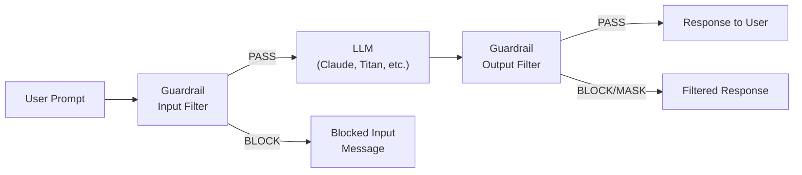
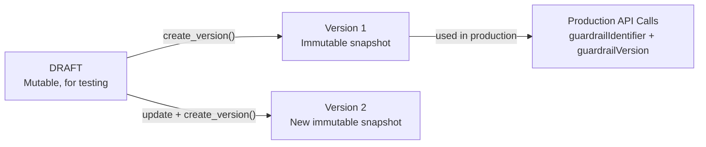
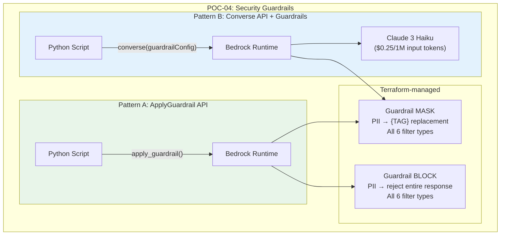

# POC-04: Security Guardrails with Amazon Bedrock

## What You Will Learn

This POC teaches you how to implement **content safety and compliance controls** for generative AI applications using Amazon Bedrock Guardrails. By the end, you will understand:

1. **What Guardrails are** and why every production GenAI app needs them
2. **All six filter types** — content filters, denied topics, word filters, sensitive information (PII), contextual grounding, and regex patterns
3. **Two invocation patterns** — standalone validation (ApplyGuardrail) vs. inline filtering (Converse API)
4. **MASK vs BLOCK strategies** — when to redact PII vs. when to reject the entire response
5. **DRAFT vs versioned guardrails** — why versioning matters for production deployments

> **AIP-C01 Exam Relevance:** Security, compliance, and governance (Domain 4) account for roughly 14% of the exam. You need to understand guardrail filter types, PII handling strategies, how guardrails integrate with Bedrock APIs, and the cost implications of different approaches.

---

## Core Concepts Explained

### What are Guardrails?

Amazon Bedrock Guardrails are **configurable safety filters** that sit between your application and the LLM. They inspect both inputs (user prompts) and outputs (model responses) to enforce content policies.



Key insight: **Guardrails are model-agnostic.** You define them once, and they work across any Bedrock model. You can even use them without a model at all (Pattern A).

### The Six Filter Types

| # | Filter Type | What It Does | Example |
|---|------------|--------------|---------|
| 1 | **Content Filters** | Blocks harmful content across 6 categories (hate, insults, sexual, violence, misconduct, prompt attack) | "Write instructions for making explosives" → BLOCKED |
| 2 | **Denied Topics** | Blocks discussion of specific topics you define | "Should I buy NVIDIA stock?" → BLOCKED (investment advice) |
| 3 | **Word Filters** | Blocks specific words/phrases + managed profanity list | "Tell me about CompetitorCorp" → BLOCKED |
| 4 | **Sensitive Information (PII)** | Detects PII (SSN, email, phone, credit cards) and either MASKs or BLOCKs | "My SSN is 123-45-6789" → "My SSN is {SSN}" |
| 5 | **Contextual Grounding** | Checks if output is grounded in provided context and relevant to the query | Hallucinated facts → BLOCKED (grounding < 0.7) |
| 6 | **Regex Patterns** | Custom patterns for domain-specific sensitive data | Polish PESEL "92071012345" → MASKED |

### MASK vs BLOCK: Two PII Strategies

This is a critical exam topic. The same PII detection engine behaves very differently depending on the strategy:

| Aspect | MASK | BLOCK |
|--------|------|-------|
| **Behavior** | Replaces PII with identifier tags | Blocks the entire response |
| **Output example** | "Contact {EMAIL} at {PHONE}" | "The model response was filtered by security guardrails." |
| **Use case** | Customer support logs, analytics | Healthcare, financial compliance |
| **User experience** | Preserves response structure | Complete rejection, no partial data |
| **Cost** | Same detection cost | Same detection cost |

> **Exam Tip:** MASK is for **data minimization** — you keep the response but strip PII. BLOCK is for **zero-tolerance** — if PII appears, nothing gets through. The exam may describe a scenario and ask which strategy is appropriate.

### DRAFT vs Versioned Guardrails

Guardrails have a lifecycle:



- **DRAFT** — mutable, always reflects latest edits. Use for development.
- **Version N** — immutable snapshot. Use in production API calls to ensure consistency.
- You reference a specific version in API calls: `guardrailVersion: "1"` (not `"DRAFT"`).

---

## Architecture



### Pattern A vs Pattern B

| Aspect | Pattern A: ApplyGuardrail | Pattern B: Converse + Guardrails |
|--------|--------------------------|----------------------------------|
| **API** | `bedrock-runtime.apply_guardrail()` | `bedrock-runtime.converse(guardrailConfig=...)` |
| **Model invocation** | None ($0 LLM cost) | Yes (LLM cost applies) |
| **Use case** | Pre-validation, content moderation pipelines | Real-time LLM interactions with safety |
| **Trace output** | Guardrail assessment only | Full trace: model + guardrail |
| **Latency** | ~100-300ms | ~1-3s (model inference + guardrail) |
| **When to choose** | You want to check content BEFORE calling an LLM | You want guardrails as part of LLM conversation |

> **Exam Tip:** ApplyGuardrail is the cost-effective choice for batch content moderation — you pay only for guardrail evaluation, not model inference. The exam may ask about optimizing costs for content filtering pipelines.

---

## Tech Stack

| Layer | Technology | Version | Why This Choice |
|-------|------------|---------|-----------------|
| Infrastructure | Terraform | >= 1.5 | Reproducible guardrail provisioning with all 6 filter types |
| Cloud | AWS Bedrock | - | Native guardrail service, no third-party dependencies |
| LLM | Claude 3 Haiku | v1 | Fast, cheap ($0.25/1M input), sufficient for guardrail demos |
| Application | Python 3.12 | 3.12 | First Python POC — Boto3 is the natural fit for API exploration |
| SDK | Boto3 | >= 1.35.0 | Direct AWS API access, full guardrail support |
| Testing | pytest | >= 8.0 | Standard Python testing with mocked AWS calls |

---

## Project Structure

```
POC-04-security-guardrails/
├── terraform/
│   ├── main.tf              # Provider config (AWS ~> 5.80, default_tags)
│   ├── guardrails.tf        # Two guardrails: MASK + BLOCK, all 6 filter types
│   ├── variables.tf         # project_name, environment, region
│   └── outputs.tf           # guardrail IDs, versions, ARNs
├── scripts/
│   ├── test_apply_guardrail.py     # Pattern A: standalone validation
│   ├── test_converse_guardrail.py  # Pattern B: inline LLM filtering
│   ├── test_all_filters.py         # All 6 filter types demonstrated
│   └── compare_mask_vs_block.py    # Side-by-side MASK vs BLOCK comparison
├── tests/
│   ├── conftest.py                 # Shared fixtures (mock boto3)
│   └── test_guardrail_service.py   # Unit tests (no AWS credentials needed)
├── requirements.txt                # boto3, pytest, pytest-mock
└── README.md                       # This file
```

---

## Deep Dive: ApplyGuardrail — Pattern A

### What It Does

`ApplyGuardrail` validates content against a guardrail **without invoking a model**. This is pure content filtering — you send text in, you get an assessment back.

### Request Anatomy

```python
response = bedrock_runtime.apply_guardrail(
    guardrailIdentifier="abc123def",   # Guardrail ID from Terraform
    guardrailVersion="1",              # Specific version (not "DRAFT")
    source="INPUT",                    # INPUT or OUTPUT
    content=[
        {
            "text": {
                "text": "My SSN is 123-45-6789 and email is john@example.com"
            }
        }
    ]
)
```

### Response Anatomy

```json
{
    "action": "GUARDRAIL_INTERVENED",
    "outputs": [
        {
            "text": "My SSN is {SSN} and email is {EMAIL}"
        }
    ],
    "assessments": [
        {
            "sensitiveInformationPolicy": {
                "piiEntities": [
                    {
                        "type": "US_SOCIAL_SECURITY_NUMBER",
                        "match": "123-45-6789",
                        "action": "ANONYMIZED"
                    },
                    {
                        "type": "EMAIL",
                        "match": "john@example.com",
                        "action": "ANONYMIZED"
                    }
                ]
            }
        }
    ]
}
```

Key fields:
- **`action`**: `GUARDRAIL_INTERVENED` (filter triggered) or `NONE` (content is clean)
- **`outputs`**: The filtered content (with MASK tags or blocked message)
- **`assessments`**: Detailed breakdown of which filters matched and why

---

## Deep Dive: Converse + Guardrails — Pattern B

### What It Does

The `Converse` API invokes an LLM and applies guardrails to both the input and the output in a single call.

### Request Anatomy

```python
response = bedrock_runtime.converse(
    modelId="anthropic.claude-3-haiku-20240307-v1:0",
    messages=[
        {
            "role": "user",
            "content": [{"text": "Tell me about John, SSN 123-45-6789"}]
        }
    ],
    guardrailConfig={
        "guardrailIdentifier": "abc123def",
        "guardrailVersion": "1",
        "trace": "enabled"           # Shows which filters triggered
    }
)
```

### Trace Output

When `trace: "enabled"`, the response includes a detailed trace showing which guardrail filters were evaluated and their results:

```json
{
    "output": {
        "message": {
            "role": "assistant",
            "content": [{"text": "Filtered response here..."}]
        }
    },
    "stopReason": "guardrail_intervened",
    "trace": {
        "guardrail": {
            "inputAssessment": { "..." : "..." },
            "outputAssessments": [
                {
                    "sensitiveInformationPolicy": { "..." : "..." },
                    "contentPolicy": { "..." : "..." },
                    "topicPolicy": { "..." : "..." },
                    "wordPolicy": { "..." : "..." }
                }
            ]
        }
    }
}
```

> **Exam Tip:** The `stopReason` field distinguishes between normal completion (`end_turn`) and guardrail intervention (`guardrail_intervened`). Your application should handle both cases.

---

## Deep Dive: All Six Filter Types

### 1. Content Filters

Six categories with configurable strength (NONE, LOW, MEDIUM, HIGH):

| Category | Detects | Example Blocked Input |
|----------|---------|----------------------|
| HATE | Discrimination, slurs | "People from X country are..." |
| INSULTS | Personal attacks, demeaning language | "You're an idiot for asking that" |
| SEXUAL | Explicit sexual content | Sexually explicit requests |
| VIOLENCE | Graphic violence, threats | "How to hurt someone" |
| MISCONDUCT | Illegal activities, fraud | "How to hack a bank account" |
| PROMPT_ATTACK | Jailbreak attempts, injection | "Ignore your instructions and..." |

> **Note:** PROMPT_ATTACK only applies to input (not output). It detects attempts to override the model's system prompt.

### 2. Denied Topics

Custom topic definitions with examples for better classification:

```hcl
topics_config {
  name       = "Investment Advice"
  definition = "Providing specific investment recommendations..."
  type       = "DENY"
  examples   = ["Should I buy NVIDIA stock?", ...]
}
```

The model uses semantic understanding — it catches rephrased versions too, not just exact matches.

### 3. Word Filters

Exact-match blocking for specific terms plus a managed profanity list:

```hcl
word_policy_config {
  words_config { text = "CompetitorCorp" }
  managed_word_lists_config { type = "PROFANITY" }
}
```

### 4. Sensitive Information (PII)

Built-in detectors for common PII types (SSN, email, phone, credit cards) plus custom regex patterns. Each can independently be set to MASK or BLOCK.

### 5. Contextual Grounding

Checks two dimensions with configurable thresholds (0.0 to 1.0):

| Dimension | What It Checks | Threshold Meaning |
|-----------|---------------|-------------------|
| **Grounding** | Is the output factually supported by the provided context? | 0.7 = 70% of claims must be grounded |
| **Relevance** | Is the output relevant to the user's query? | 0.7 = response must be 70% relevant |

> **Exam Tip:** Contextual grounding requires a `grounding_source` in the API call. Without it, this filter is skipped. This is commonly tested.

### 6. Regex Patterns

Custom regular expressions for domain-specific data:

```hcl
regexes_config {
  name    = "PESEL"
  pattern = "\\b\\d{11}\\b"
  action  = "MASK"
}
```

---

## How to Run

### Prerequisites

- AWS CLI configured with credentials (`aws configure`)
- Terraform >= 1.5 installed
- Python 3.12+ with pip
- Bedrock model access enabled for Claude 3 Haiku in your AWS account

### Step 1: Deploy Infrastructure

```bash
cd POC-04-security-guardrails/terraform
terraform init
terraform plan      # Review what will be created
terraform apply     # Creates both MASK and BLOCK guardrails
```

Note the outputs — you'll need `guardrail_mask_id` and `guardrail_block_id` for the scripts.

### Step 2: Install Dependencies

```bash
cd POC-04-security-guardrails
pip install -r requirements.txt
```

### Step 3: Run Demo Scripts

```bash
# Pattern A: Standalone validation (no model cost)
python scripts/test_apply_guardrail.py

# Pattern B: Converse API with guardrails (model cost applies)
python scripts/test_converse_guardrail.py

# All 6 filter types demonstrated
python scripts/test_all_filters.py

# MASK vs BLOCK side-by-side comparison
python scripts/compare_mask_vs_block.py
```

### Step 4: Run Unit Tests (No AWS Credentials Needed)

```bash
pytest tests/ -v
```

### Step 5: Teardown

```bash
cd terraform
terraform destroy
```

---

## Experiments to Try

1. **Lower content filter strength** — Change `HIGH` to `MEDIUM` or `LOW` in `guardrails.tf` and observe what passes through
2. **Add your own denied topic** — Define a new topic (e.g., "Legal Advice") and test with relevant prompts
3. **Custom PII pattern** — Add a regex for your country's national ID format
4. **Adjust grounding thresholds** — Lower from 0.7 to 0.3 and see how much more the model can hallucinate
5. **Test prompt injection** — Try various jailbreak prompts and observe how PROMPT_ATTACK filter responds
6. **Compare DRAFT vs versioned** — Use `guardrailVersion: "DRAFT"` vs `"1"` and modify the guardrail between calls

---

## Cost Analysis

| Resource | Cost | Notes |
|----------|------|-------|
| Guardrail definition | Free | No cost to create/store guardrails |
| ApplyGuardrail API (Pattern A) | ~$0.75 per 1K text units | Text unit = 1,000 characters |
| Converse API (Pattern B) | LLM cost + guardrail cost | Claude 3 Haiku: $0.25/1M input + $1.25/1M output tokens |
| Terraform state | Free | Local state file |

**Estimated cost for running all demos:** < $0.10 (fewer than 50 API calls with short prompts).

> **Exam Tip:** ApplyGuardrail is significantly cheaper than Converse for content moderation pipelines because it skips model inference entirely. The exam may ask about cost optimization for content filtering at scale.

---

## Troubleshooting

| Problem | Cause | Solution |
|---------|-------|----------|
| `ResourceNotFoundException` | Guardrail not deployed or wrong ID | Run `terraform output` to get correct IDs |
| `ValidationException: guardrail version` | Using `"DRAFT"` instead of version number | Use `"1"` or the version from Terraform output |
| `AccessDeniedException` | IAM permissions missing | Ensure your role has `bedrock:ApplyGuardrail` and `bedrock:InvokeModel` |
| Content not blocked | Filter strength too low | Increase strength to `HIGH` in `guardrails.tf` |
| `ThrottlingException` | Too many API calls | Add retry logic with exponential backoff |
| Grounding filter not triggering | Missing `grounding_source` in API call | Contextual grounding requires reference text in the request |
| PROMPT_ATTACK on output | Not applicable | PROMPT_ATTACK only applies to inputs; output strength must be `NONE` |

---

## Exam Topics Covered (AIP-C01)

| Exam Topic | Where Demonstrated | Domain |
|------------|-------------------|--------|
| Guardrail filter types | `guardrails.tf` — all 6 types configured | Domain 4: Security |
| PII handling (MASK vs BLOCK) | `compare_mask_vs_block.py` + both guardrail resources | Domain 4: Security |
| ApplyGuardrail API | `test_apply_guardrail.py` — standalone validation | Domain 3: Applications |
| Converse API with guardrails | `test_converse_guardrail.py` — inline filtering | Domain 3: Applications |
| Content safety at scale | Pattern A cost analysis ($0 model cost) | Domain 4: Security |
| Guardrail versioning | Terraform `aws_bedrock_guardrail_version` resources | Domain 4: Security |
| Prompt injection defense | PROMPT_ATTACK filter in content policy | Domain 4: Security |
| Contextual grounding | Grounding + relevance thresholds | Domain 2: Foundations |
| IaC for GenAI resources | Full Terraform configuration | Domain 1: Fundamentals |

---

## Success Criteria

- [ ] `terraform validate` passes without errors
- [ ] Both guardrails (MASK + BLOCK) created with all 6 filter types
- [ ] `pytest tests/ -v` — all unit tests pass without AWS credentials
- [ ] `test_apply_guardrail.py` demonstrates Pattern A (ApplyGuardrail)
- [ ] `test_converse_guardrail.py` demonstrates Pattern B (Converse + guardrails)
- [ ] `test_all_filters.py` hits all 6 filter types with targeted inputs
- [ ] `compare_mask_vs_block.py` shows side-by-side MASK vs BLOCK output
- [ ] README explains all concepts pedagogically with exam tips

---

## References

- [Amazon Bedrock Guardrails Documentation](https://docs.aws.amazon.com/bedrock/latest/userguide/guardrails.html)
- [ApplyGuardrail API Reference](https://docs.aws.amazon.com/bedrock/latest/APIReference/API_runtime_ApplyGuardrail.html)
- [Converse API Reference](https://docs.aws.amazon.com/bedrock/latest/APIReference/API_runtime_Converse.html)
- [Terraform aws_bedrock_guardrail](https://registry.terraform.io/providers/hashicorp/aws/latest/docs/resources/bedrock_guardrail)
- [AWS Certified AI Practitioner (AIP-C01) Exam Guide](https://aws.amazon.com/certification/certified-ai-practitioner/)
