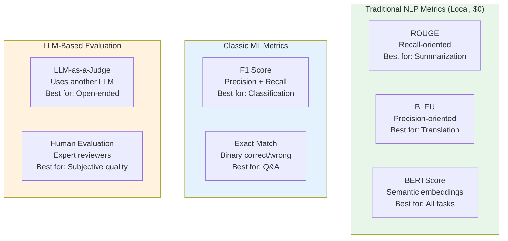
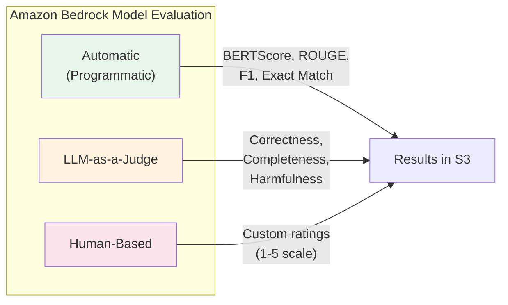
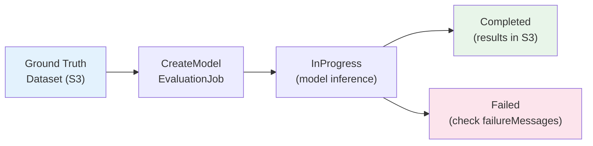
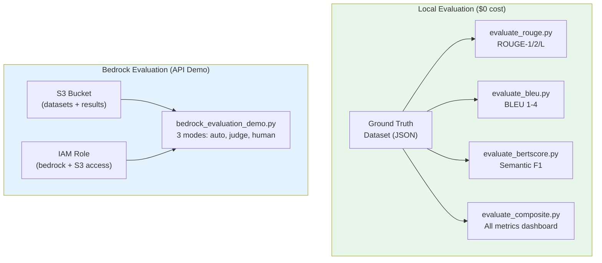

# POC-05: Automated Evaluation of Foundation Models

## What You Will Learn

This POC teaches you how to **evaluate foundation model outputs** using automated metrics — the core skill tested across multiple domains of the AIF-C01 exam. By the end, you will understand:

1. **Which metric for which task** — ROUGE for summarization, BLEU for translation, BERTScore for semantic similarity
2. **How each metric works** — recall vs. precision orientation, n-gram vs. embedding-based
3. **Bedrock Model Evaluation** — three modes (automatic, human, LLM-as-a-judge), API structure, and cost model
4. **Ground truth datasets** — format, creation, and why they are essential for evaluation
5. **Interpreting scores** — what "good" looks like for each metric, and when scores are misleading

> **AIF-C01 Exam Relevance:** Evaluation metrics span Domain 2 (Fundamentals, 24%) and Domain 3 (Applications, 28%). You need to know ROUGE, BLEU, BERTScore, perplexity, and the three Bedrock evaluation modes. This is one of the most heavily tested topics.

---

## Core Concepts Explained

### Why Evaluate?

Foundation models can hallucinate, drift, or produce outputs that look correct but aren't. Automated evaluation provides:

- **Objective measurement** — replace "it seems good" with quantifiable scores
- **Regression detection** — catch quality drops when changing models or prompts
- **Model comparison** — choose the best model for your task with data, not intuition

### The Three Families of Metrics



---

## Deep Dive: ROUGE (Summarization Metric)

**ROUGE** = Recall-Oriented Understudy for Gisting Evaluation

ROUGE measures **how much of the reference text is captured** in the generated text. It is **recall-oriented** — it checks if the important content from the reference appears in the output.

| Variant | What It Measures | Use Case |
|---------|-----------------|----------|
| **ROUGE-1** | Unigram (word) overlap | Key term coverage |
| **ROUGE-2** | Bigram overlap | Phrase-level similarity |
| **ROUGE-L** | Longest common subsequence | Sentence structure preservation |

### How ROUGE-1 Works (Example)

```
Reference: "Amazon Bedrock provides access to foundation models"
Generated: "Bedrock provides foundation model access via API"

Overlapping words: {Bedrock, provides, access, foundation, model(s)}
Recall = 5/7 = 0.71  (5 of 7 reference words found in generated)
Precision = 5/7 = 0.71  (5 of 7 generated words found in reference)
F1 = 2 * (0.71 * 0.71) / (0.71 + 0.71) = 0.71
```

> **Exam Tip:** ROUGE is the standard metric for **summarization** evaluation. If the exam describes a summarization pipeline and asks which metric to use — the answer is ROUGE. Remember: ROUGE = Recall = sumaRization (mnemonic: R for R).

---

## Deep Dive: BLEU (Translation Metric)

**BLEU** = Bilingual Evaluation Understudy

BLEU measures **how much of the generated text matches the reference**. It is **precision-oriented** — it checks if the words the model produced are actually in the reference.

| Component | What It Does |
|-----------|-------------|
| **n-gram precision** | Measures 1-gram, 2-gram, 3-gram, 4-gram overlap |
| **Brevity penalty** | Penalizes translations that are too short |
| **Composite score** | Geometric mean of all n-gram precisions |

### BLEU vs ROUGE — Key Distinction

| Aspect | ROUGE | BLEU |
|--------|-------|------|
| **Orientation** | Recall (did we capture the reference?) | Precision (is our output correct?) |
| **Primary task** | Summarization | Translation |
| **Penalizes** | Missing important content | Adding incorrect content |
| **Short outputs** | May score high (less to miss) | Penalized by brevity penalty |

> **Exam Tip:** BLEU is the standard metric for **translation**. Key distinction from ROUGE: BLEU = precision = "how correct is what we generated?" vs. ROUGE = recall = "how much of the reference did we capture?"

---

## Deep Dive: BERTScore (Semantic Similarity)

**BERTScore** uses pre-trained BERT contextual embeddings to compute semantic similarity via cosine similarity. Unlike BLEU/ROUGE which count exact word matches, BERTScore understands **meaning**.

### Why BERTScore Matters

```
Reference: "The automobile was repaired at the garage."
Generated: "The car was fixed at the workshop."

BLEU score:  ~0.15 (few exact word matches)
BERTScore:   ~0.92 (semantically equivalent)
```

BERTScore catches synonyms (automobile=car, repaired=fixed, garage=workshop) that BLEU and ROUGE miss entirely.

| Aspect | BLEU/ROUGE | BERTScore |
|--------|-----------|-----------|
| **Matching** | Exact n-gram | Contextual embeddings |
| **Paraphrasing** | Penalized (different words) | Handled well (same meaning) |
| **Speed** | Very fast | Slower (needs model inference) |
| **Task agnostic** | Task-specific | Works for any text comparison |

> **Exam Tip:** BERTScore is the most **robust** metric for general-purpose evaluation. It is available as a built-in programmatic metric in Bedrock Model Evaluation. The exam may ask: "Which metric handles paraphrasing?" — answer is BERTScore.

---

## Deep Dive: Perplexity (Language Model Quality)

**Perplexity** measures how well a language model predicts the next token. It is NOT a comparison metric (no reference needed) — it evaluates the model itself.

- **Lower perplexity = better model** (more confident, more accurate predictions)
- Formula: exp(average negative log-likelihood per token)
- Typical ranges: 10-50 for well-trained models, 100+ for poor models

> **Exam Tip:** Perplexity is the only metric that evaluates the **model itself**, not its outputs against a reference. It measures prediction confidence. Lower = better. The exam may ask which metric doesn't need ground truth — answer is perplexity.

---

## Deep Dive: Bedrock Model Evaluation Service

Amazon Bedrock offers a managed evaluation service with three modes:



### Three Evaluation Modes Compared

| Mode | How It Works | Metrics | Cost | When to Use |
|------|-------------|---------|------|-------------|
| **Automatic** | Programmatic metric computation | BERTScore, ROUGE, F1, Exact Match | Inference tokens only | Large-scale, objective comparison |
| **LLM-as-a-Judge** | Another LLM evaluates outputs | Correctness, Completeness, Harmfulness, Faithfulness | Judge + evaluated model tokens | Open-ended quality assessment |
| **Human-Based** | Human workers rate outputs | Custom ratings, subjective quality | $0.21/task + inference tokens | Final validation, edge cases |

### Evaluation Job Workflow



> **Exam Tip:** Bedrock evaluation has **no orchestration fee** — you only pay for model tokens consumed. Automatic mode is cheapest (programmatic metrics are computed for free). Human evaluation is most expensive ($0.21 per task appears on the SageMaker billing line).

---

## Evaluation Framework Comparison (Exam Knowledge)

| Framework | Type | Cost | Metrics | AWS Integration |
|-----------|------|------|---------|-----------------|
| **Bedrock Model Evaluation** | Managed service | Token costs + $0.21/task (human) | BERTScore, ROUGE, F1, LLM-judge | Native (S3, IAM, Console) |
| **FMEval** | AWS open-source library | Free (local) | Toxicity, accuracy, semantic similarity | pip install fmeval |
| **RAGAS** | Open-source framework | LLM API costs (~$0.06/sample) | Faithfulness, Answer Relevancy, Context Precision | Via LangChain/Boto3 |
| **Local NLP metrics** | Libraries (this POC) | Free (local, no API) | ROUGE, BLEU, BERTScore | N/A (standalone) |

> **Exam Tip:** Know that **FMEval** is AWS's open-source evaluation library. RAGAS is popular for RAG evaluation but requires LLM calls (costs money). Bedrock Model Evaluation is the managed service. The exam may ask which tool is AWS-native for FM evaluation — answer is FMEval or Bedrock Model Evaluation.

---

## Architecture



---

## Tech Stack

| Layer | Technology | Version | Why This Choice |
|-------|------------|---------|-----------------|
| Infrastructure | Terraform | >= 1.5 | S3 + IAM provisioning for Bedrock evaluation |
| Metrics | rouge-score | >= 0.1.2 | Google's ROUGE implementation (fast, accurate) |
| Metrics | nltk | >= 3.9 | BLEU score with smoothing and brevity penalty |
| Metrics | bert-score | >= 0.3.13 | BERTScore with pre-trained embeddings |
| SDK | Boto3 | >= 1.35.0 | Bedrock evaluation job API |
| Testing | pytest | >= 8.0 | Unit tests with mocked AWS calls |

---

## Project Structure

```
POC-05-automated-evaluation/
├── terraform/
│   ├── main.tf              # Provider config (AWS ~> 5.80, default_tags)
│   ├── s3.tf                # S3 bucket for datasets and evaluation results
│   ├── iam.tf               # IAM role for Bedrock evaluation jobs
│   ├── variables.tf         # project_name, environment, region
│   └── outputs.tf           # Bucket name, role ARN, account info
├── datasets/
│   └── ground_truth.json    # 13 examples: summarization, QA, translation, hallucination
├── scripts/
│   ├── evaluate_rouge.py         # ROUGE-1/2/L for summarization ($0)
│   ├── evaluate_bleu.py          # BLEU 1-4 for translation ($0)
│   ├── evaluate_bertscore.py     # BERTScore semantic similarity ($0)
│   ├── evaluate_composite.py     # All metrics dashboard ($0)
│   └── bedrock_evaluation_demo.py # Bedrock evaluation job API (dry-run/$0)
├── tests/
│   ├── conftest.py                # Fixtures: mock Bedrock responses, sample data
│   └── test_evaluation_metrics.py # Unit tests (no AWS credentials needed)
├── requirements.txt               # rouge-score, nltk, bert-score, boto3, pytest
└── README.md                      # This file
```

---

## How to Run

### Prerequisites

- Python 3.11+ with pip
- AWS CLI configured (only for Bedrock evaluation demo in live mode)
- ~400MB disk space (BERTScore downloads model on first run)

### Step 1: Install Dependencies

```bash
cd POC-05-automated-evaluation
pip install -r requirements.txt
```

### Step 2: Run Local Evaluation Scripts ($0 cost)

```bash
# ROUGE evaluation (summarization)
python scripts/evaluate_rouge.py

# BLEU evaluation (translation)
python scripts/evaluate_bleu.py

# BERTScore evaluation (semantic similarity -- first run downloads model)
python scripts/evaluate_bertscore.py

# Composite dashboard (all metrics in one view)
python scripts/evaluate_composite.py
```

### Step 3: Review Bedrock Evaluation API (dry-run, $0)

```bash
# Shows API payloads for all 3 evaluation modes without making calls
python scripts/bedrock_evaluation_demo.py
```

### Step 4: Run Unit Tests (No AWS Credentials Needed)

```bash
pytest tests/ -v
```

### Step 5: (Optional) Deploy Infrastructure

```bash
cd terraform
terraform init
terraform plan      # Review S3 bucket + IAM role
terraform apply     # Creates evaluation infrastructure
```

### Step 6: (Optional) Teardown

```bash
cd terraform
terraform destroy
```

---

## Experiments to Try

1. **Add your own examples** to `datasets/ground_truth.json` and see how scores change
2. **Create a deliberately bad summary** and observe how ROUGE drops while BERTScore may remain moderate (if semantically close)
3. **Compare identical paraphrases** — BLEU will score low, BERTScore will score high (demonstrates the key difference)
4. **Add a hallucinated answer** and compare its BERTScore to a faithful answer
5. **Switch BERTScore model** — edit `evaluate_bertscore.py` to use a different model and compare

---

## Cost Analysis

| Resource | Cost | Notes |
|----------|------|-------|
| ROUGE computation | Free | Local, no API calls |
| BLEU computation | Free | Local, no API calls |
| BERTScore computation | Free | Local, pre-trained model on CPU |
| Bedrock demo (dry-run) | Free | Prints payloads, no API calls |
| S3 bucket (if deployed) | Free | S3 free tier: 5GB storage |
| Terraform state | Free | Local state file |

**Total cost for running all demos:** $0.00

---

## Troubleshooting

| Problem | Cause | Solution |
|---------|-------|----------|
| `ModuleNotFoundError: rouge_score` | Dependencies not installed | Run `pip install -r requirements.txt` |
| BERTScore first run is slow | Downloading pre-trained model (~400MB) | Normal behavior, subsequent runs use cache |
| `UnicodeDecodeError` on Windows | cp1252 encoding issues | All dataset text uses ASCII-safe characters |
| BLEU score = 0.0 | No n-gram overlap at all | Check that reference and generated use same language |
| ROUGE scores all 1.0 | Reference and generated are identical | Expected for exact matches |
| `nltk` data missing | NLTK tokenizer not downloaded | Run `python -c "import nltk; nltk.download('punkt_tab')"` |

---

## Exam Topics Covered (AIF-C01)

| Exam Topic | Where Demonstrated | Domain |
|------------|-------------------|--------|
| ROUGE metric (summarization) | `evaluate_rouge.py` — ROUGE-1/2/L computation | Domain 2: Fundamentals |
| BLEU metric (translation) | `evaluate_bleu.py` — n-gram precision + brevity penalty | Domain 2: Fundamentals |
| BERTScore (semantic similarity) | `evaluate_bertscore.py` — contextual embedding comparison | Domain 2: Fundamentals |
| Perplexity concept | README Deep Dive section | Domain 2: Fundamentals |
| Bedrock Model Evaluation modes | `bedrock_evaluation_demo.py` — all 3 modes | Domain 3: Applications |
| Ground truth datasets | `datasets/ground_truth.json` — format and creation | Domain 3: Applications |
| Evaluation job lifecycle | Unit tests — create, in-progress, completed, failed | Domain 3: Applications |
| FMEval vs RAGAS vs Bedrock | README comparison table | Domain 3: Applications |
| Metric selection by task | `evaluate_composite.py` — dashboard with recommendations | Domain 2: Fundamentals |
| Cost optimization for evaluation | Cost analysis section — $0 local vs. managed service costs | Domain 3: Applications |

---

## Success Criteria

- [ ] `terraform validate` passes without errors
- [ ] `pytest tests/ -v` — all unit tests pass without AWS credentials
- [ ] `evaluate_rouge.py` computes ROUGE-1/2/L for summarization examples
- [ ] `evaluate_bleu.py` computes BLEU 1-4 for translation examples
- [ ] `evaluate_bertscore.py` computes semantic F1 across all task types
- [ ] `evaluate_composite.py` produces a dashboard with metric recommendations per task
- [ ] `bedrock_evaluation_demo.py` prints API payloads for all 3 evaluation modes
- [ ] Ground truth dataset covers 4 task types with 13+ examples
- [ ] README explains all metrics pedagogically with exam tips

---

## References

- [Amazon Bedrock Model Evaluation](https://docs.aws.amazon.com/bedrock/latest/userguide/model-evaluation.html)
- [Amazon Bedrock Pricing — Evaluation](https://aws.amazon.com/bedrock/pricing/)
- [FMEval — AWS Open-Source Evaluation Library](https://github.com/aws/fmeval)
- [ROUGE Score — Google Research](https://github.com/google-research/google-research/tree/master/rouge)
- [BLEU — NLTK Documentation](https://www.nltk.org/api/nltk.translate.bleu_score.html)
- [BERTScore Paper](https://arxiv.org/abs/1904.09675)
- [AWS Certified AI Practitioner (AIF-C01) Exam Guide](https://aws.amazon.com/certification/certified-ai-practitioner/)
